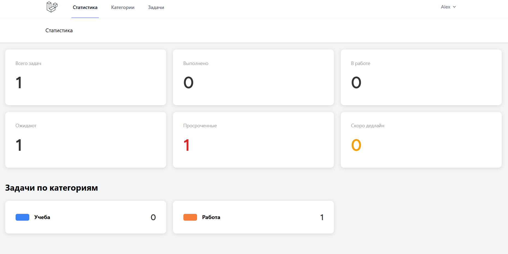
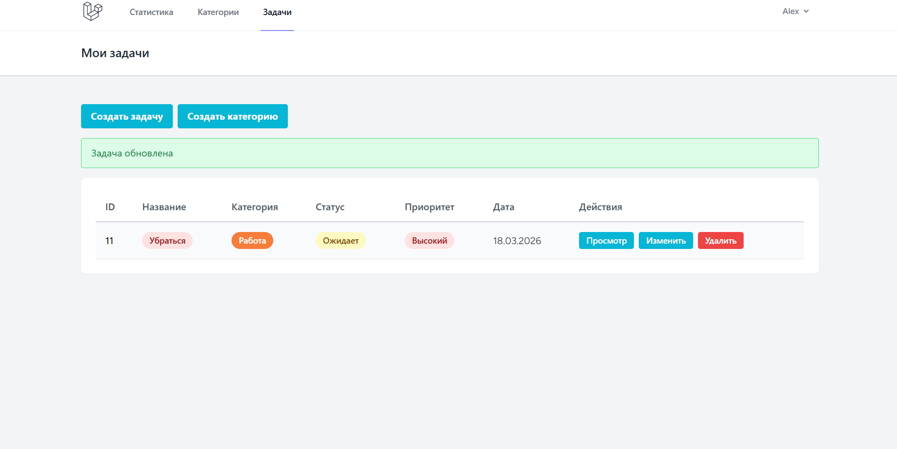
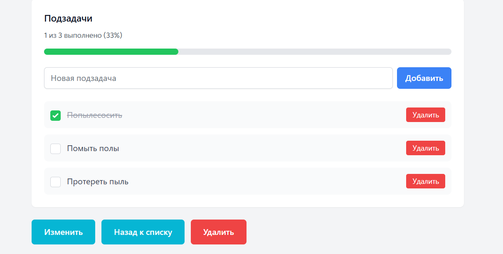

# Task Manager

Веб-приложение для управления задачами с системой дедлайнов, категориями и статистикой выполнения.

## Скриншоты

### Dashboard со статистикой



### Список задач с цветовой маркировкой



### Просмотр задачи с подзадачами



## Основной функционал

### Управление задачами

- Создание, редактирование, удаление задач
- Категории с цветовой маркировкой
- Три уровня приоритета (высокий, средний, низкий)
- Установка дедлайнов
- Статусы задач (ожидает, в работе, завершена)

### Подзадачи

- Добавление подзадач к основной задаче
- Отметка выполнения чекбоксом
- Прогресс-бар выполнения
- Визуальное зачёркивание выполненных

### Система отслеживания дедлайнов

- Красное выделение просроченных задач
- Оранжевое предупреждение за 3 дня до дедлайна
- Счётчики просроченных и скоро истекающих задач на дашборде

### Dashboard и аналитика

- Статистика по задачам (всего, выполнено, в работе, ожидают, просрочено, скоро дедлайн)
- Разбивка задач по категориям
- Цветовые индикаторы для быстрой визуальной оценки

### Аутентификация

- Регистрация и авторизация пользователей
- Изолированные задачи для каждого пользователя

## Технологический стек

**Backend:**

- Laravel 12
- PHP 8.4
- MySQL

**Frontend:**

- Blade Templates
- Tailwind CSS
- Vite

**Аутентификация:**

- Laravel Breeze

## Установка и запуск

### Требования

- PHP >= 8.4
- Composer
- Node.js & NPM
- MySQL

### Инструкция по установке

1. Клонировать репозиторий

```bash
git clone https://github.com/Kodjer/laravel-task-manager.git
cd laravel-task-manager
```

2. Установить зависимости PHP

```bash
composer install
```

3. Установить зависимости JavaScript

```bash
npm install
```

4. Создать файл окружения

```bash
cp .env.example .env
php artisan key:generate
```

5. Настроить базу данных

Создайте базу данных MySQL и настройте `.env`:

```
DB_CONNECTION=mysql
DB_HOST=127.0.0.1
DB_PORT=3306
DB_DATABASE=task_manager
DB_USERNAME=root
DB_PASSWORD=
```

6. Запустить миграции

```bash
php artisan migrate
```

7. Собрать фронтенд (в отдельном терминале)

```bash
npm run dev
```

8. Запустить сервер разработки

```bash
php artisan serve
```

Приложение доступно по адресу: http://localhost:8000

## Архитектура

### Структура базы данных

```
users
  - id
  - name
  - email
  - password

tasks
  - id
  - title
  - description
  - status (enum: pending, in_progress, completed)
  - priority (enum: low, normal, high)
  - due_date
  - user_id (foreign key)
  - category_id (foreign key)
  - created_at
  - updated_at

categories
  - id
  - name
  - color
  - user_id (foreign key)
  - created_at
  - updated_at

subtasks
  - id
  - task_id (foreign key)
  - title
  - is_completed (boolean)
  - order
  - created_at
  - updated_at
```

### Связи моделей

- User hasMany Tasks
- User hasMany Categories
- Task belongsTo User
- Task belongsTo Category
- Task hasMany Subtasks
- Subtask belongsTo Task

### Основные контроллеры

- `TaskController` - управление задачами (CRUD)
- `CategoryController` - управление категориями
- `SubtaskController` - управление подзадачами
- `DashboardController` - статистика и аналитика

## Особенности реализации

- MVC архитектура
- Eloquent ORM для работы с базой данных
- Blade компоненты для переиспользуемых UI элементов
- Route middleware для защиты маршрутов
- Валидация форм на стороне сервера
- Адаптивный дизайн на Tailwind CSS
- Цветовая кодировка для визуальной идентификации приоритетов и статусов

## Автор

Alex - Junior PHP Developer

GitHub: https://github.com/Kodjer

## Лицензия

Этот проект создан в образовательных целях.
